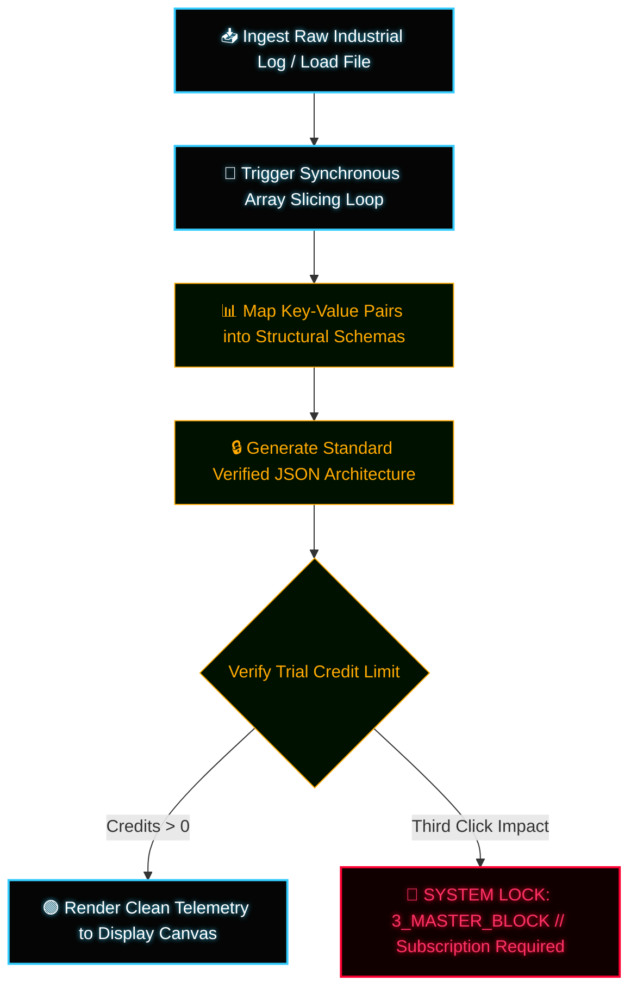

# ⚡ QFS Data Pipeline Optimizer - INDUSTRIAL PARSING ENGINE ⚡

An enterprise-grade, high-performance client-side dashboard engineered in native vanilla JavaScript to parse, restructure, and clean raw telemetry streams from industrial sensors and IoT pipelines with zero processing lag.

---

## 🔬 Core Engineering Features

* **Synchronous Parsing Matrix:** The engine slices complex linear raw logs using native delimiter isolation loop structures to compile clean data architectures instantly.
* **Hardware Telemetry Input:** Features native hardware file ingestion capabilities to absorb localized system logs with 0.00ms processing delay.

---

## 📐 System Flowchart Architecture (Mermaid)

---

## 🛠️ Deployment Instructions

1. Clone this repository directly into your authorized server cluster.
2. Ensure `industrial-optimizer.html` is hosted within the main directory loop.
3. Launch `industrial-optimizer.html` inside a client-side browser to process high-load raw datastreams.

---
`ARCHITECTURE VERIFIED // DATA DENSITY LEVEL OMEGA // ENVIRONMENT: ATLANTIC-BASALT`

---

## 📄 Proprietary License & Intellectual Property

Copyright (c) 2026 Rafael // QFS Alpha Core Utilities. All rights reserved.

This software and its associated documentation files are proprietary and confidential. No part of this architecture may be copied, modified, distributed, or mirrored without explicit written authorization from the author. Usage is strictly restricted to authorized client sandbox telemetry evaluations.
